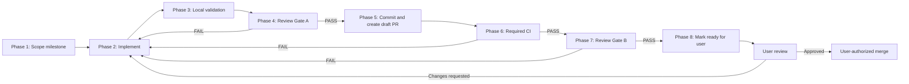

# Milestone Implementation Loop

This is the mandatory lifecycle for every milestone and feature implementation in OneShot.
Gate A is bound to reviewed file content against the base branch (`develop`).
Gate B and final readiness are bound to the exact pull-request head commit.

## Lifecycle



## Phase 1 - Scope the milestone

Create an implementation plan / proposal record containing:

- Outcome and user value;
- Acceptance criteria;
- In-scope and out-of-scope behavior;
- Affected components and interfaces;
- Test and measurement plan;
- Security, privacy, operational, and cost risks;
- Rollback or safe-disable strategy.

Exit gate: The work is scoped small enough for one focused pull request and has
objective, testable acceptance criteria.

## Phase 2 - Implement

1. Create a branch from the latest base branch (`develop`):
   ```bash
   git checkout develop
   git pull origin develop
   git checkout -b feature/<name>
   ```
   Use `fix/<name>` or `milestone/<id>-<name>` when appropriate.
2. Make the smallest coherent change satisfying the milestone.
3. Add or update tests and documentation alongside code.
4. Inspect the full workspace diff (`git status`, `git diff`, untracked files)
   for scope drift, generated files, secrets, and unrelated edits.
5. Stage only the complete intended candidate. Leave no intended change
   unstaged or untracked before Gate A.

The implementation may remain uncommitted through Gate A. Do not push a branch
or create a PR yet.

Exit gate: The workspace contains one coherent candidate change and no unrelated work.

## Phase 3 - Local validation

Run repository validation commands from the project root:

```bash
# Execute local quality checks (lint, format check, type check, test suites)
```

Record each command and its result. Fix failures and repeat until clean. Do not
classify an expected failure as a pass.

Exit gate: All applicable local checks pass for the current workspace content.

## Phase 4 - Review Gate A: workspace implementation review

Refresh the base, then copy the two printed SHAs into the review evidence:

```bash
git fetch origin develop
git rev-parse origin/develop
git write-tree
git diff --cached <recorded-base-sha>
```

`<recorded-base-sha>` is the immutable output from `git rev-parse
origin/develop`, not the mutable remote-tracking ref itself.

Run a fresh, read-only independent review session using
`.agent/review-prompts/implementation-review.md`. Any capable review tool may be
used. Record its tool and platform-reported model name.
If the platform does not expose a model identifier, record
`not exposed by platform`.

The reviewer evaluates:
- Complete staged candidate tree against the recorded `develop` SHA;
- Acceptance criteria coverage;
- Edge cases, error handling, regressions;
- Security, secrets, and licensing;
- Test adequacy and architecture fit.

Gate decision:
- `PASS`: No blocking correctness, security, data-loss, architecture, test, or
  acceptance-criteria findings.
- `FAIL`: At least one blocking finding, missing evidence, incomplete review, or
  ambiguous verdict.

On `FAIL`, resolve every blocking finding, rerun local validation, and repeat Gate A
in a fresh session.

Exit gate: Gate A returns an explicit `VERDICT: PASS` containing reviewer tool,
model, base SHA, and candidate tree SHA.

## Phase 5 - Commit and create draft pull request

Only after Gate A passes:

1. Confirm `git write-tree` still equals the reviewed candidate tree SHA.
2. Commit the reviewed staged change without modifying its content.
3. Confirm `git rev-parse "HEAD^{tree}"` equals the reviewed candidate tree SHA.
4. Push the branch to origin:
   ```bash
   git push -u origin HEAD
   ```
5. Create a **draft** pull request against `develop`.
6. Fill out `.github/PULL_REQUEST_TEMPLATE.md` with:
   - Milestone outcome & scope;
   - Acceptance criteria checklist;
   - Risk assessment;
   - Validation evidence;
   - Review Gate A verdict and reviewer evidence.
7. Keep the pull request in draft state.

Exit gate: The draft PR is created against `develop` with complete Gate A evidence.

## Phase 6 - Required CI

Wait for all required GitHub Actions checks to finish on the draft PR head commit.

If CI fails or requires a content change:
1. Fix the issue locally;
2. Rerun local validation (Phase 3);
3. Rerun Review Gate A (Phase 4) for the updated content;
4. Commit, push, and wait for CI.

Exit gate: All required status checks are green for the exact PR head commit.

## Phase 7 - Review Gate B: exact draft PR review

Gate B runs in an independent reviewer session after CI passes, evaluating the draft PR
using `.agent/review-prompts/draft-pr-review.md`.

Gate B may use any capable review tool, including a different tool from Gate A.
It must run in a fresh read-only session and record its tool and
platform-reported model, or `not exposed by platform`.

The reviewer independently inspects:
- PR title, description, and diff against `develop`;
- Commits and file changes;
- Required CI status and check logs;
- Gate A evidence and resolution of earlier findings;
- Equality of the PR head tree and Gate A candidate tree;
- Merge readiness and residual risks.

On `FAIL`, return to Phase 2. Any content change requires rerunning Phases 3 through 7.

Exit gate: Gate B returns an explicit `VERDICT: PASS` for the exact current PR head SHA.

## Phase 8 - Ready for user review

After Gate A, CI, and Gate B all pass:

1. Add the Gate B verdict and evidence link to the PR description or comment.
2. Mark the draft pull request as ready for review (`gh pr ready <pr-number>`).
3. Notify the user with:
   - Branch name & head commit SHA;
   - PR URL;
   - Checks run & Gate A / B verdicts;
   - Known limitations or risks.
4. Stop. **Do not merge.**

The user performs the final review and explicitly decides whether to merge into `develop`.

## Fail-closed conditions

Do not advance a gate when:
- Review output is truncated or lacks an explicit `VERDICT: PASS`;
- Target base branch or PR head SHA is ambiguous;
- Required CI is missing, pending, skipped, or failing;
- Unresolved blocking findings remain.
