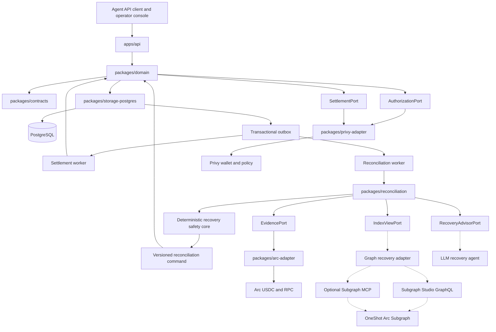
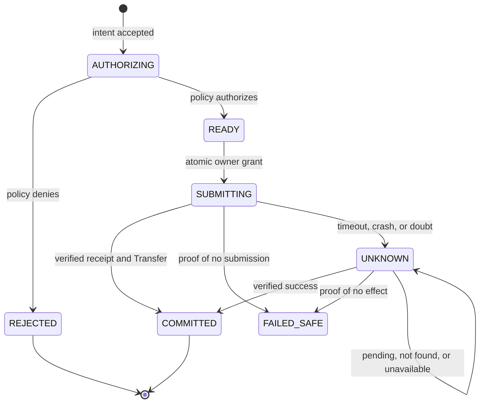

<!-- Rendered from apps/web's own `.top-nav` by `scripts/render-nav-panel.mjs`;
     re-run that script after a brand token, mark, or nav label change. -->
<picture>
  <source
    media="(prefers-color-scheme: dark)"
    srcset="docs/assets/nav-panel-dark.svg"
  />
  
</picture>

# OneShot

**One job. Many retries. One settlement.**

OneShot protects an approved business obligation from duplicate committed
settlements through retries, crashes, lost responses, queue redelivery,
parallel workers, and multiple agent instances.

Product direction: **resumable paid tools for business agents** — resume the
job, not the payment. The settlement engine includes one team-operated testnet
report supplier, task-bound order/result delivery, a one-tool MCP endpoint for
agents, and separate public (`/`), agent-docs (`/docs/mcp`), and authenticated
cabinet (`/app`) routes. Resumable external work requires supplier support; this
is not a guarantee of exactly-once execution for arbitrary tools.

The cardinality it protects is:

```text
1 Business Intent  /  N Attempts  /  at most 1 committed Settlement
```

## The problem

An autonomous agent is told to make a business payment for 1.25 USDC. It
submits the payment. The connection drops before the response arrives.

The agent now cannot tell the difference between:

- the payment never left, and
- the payment succeeded and the receipt was lost.

Retrying might pay twice. Not retrying might never pay at all. Most systems
guess. Guessing with money is how you get duplicate settlements.

OneShot refuses to guess. An uncertain outcome becomes a durable `UNKNOWN`
state that must be reconciled from authoritative evidence before anything else
happens. **Absence of proof that a payment happened is never treated as proof
that it did not.**

## How it works



Solid edges are implemented. Dashed runtime edges are bounded production paths:
the active Arc Testnet profile uses authenticated, pinned Subgraph Studio
GraphQL; Subgraph MCP remains an optional fail-closed adapter for deployments
served by The Graph Network. The recovery agent remains advisory. Neither
external index evidence nor model advice can authorize settlement.

### The state machine

Every Business Intent moves through durable, compare-and-set transitions. Only
one of them grants the right to touch the outside world.



`UNKNOWN` never grants permission to submit again. It is resolved by evidence
or escalated to a human.

## Design rules

These are enforced in code and tests, not by convention:

- **A stable `business_intent_id` survives everything.** Retries, restarts,
  redelivery, and parallel workers all converge on the same intent.
- **One atomic transition grants submission ownership.** Exactly one worker
  crosses the external boundary.
- **Doubt fails closed.** A timeout, reset, truncated response, or any
  unrecognized error is treated as _possibly submitted_, never as a safe retry.
- **A successful receipt is not confirmation.** Settlement is committed only
  when the receipt carries exactly one matching ERC-20 Transfer, to the expected
  recipient, for the exact amount, from the configured token.
- **Money is integer atomic units and `bigint`.** No JavaScript floating point
  touches a monetary value anywhere.
- **External indexes are evidence, never authority.** An empty or delayed index
  result cannot authorize a payment.

## Integrations

| System        | Role                                                                                                                                                          |
| ------------- | ------------------------------------------------------------------------------------------------------------------------------------------------------------- |
| **Privy**     | Corporate wallet, scoped authorization, and spending policy                                                                                                   |
| **Arc**       | USDC settlement rail (Arc Testnet, chain `5042002`)                                                                                                           |
| **The Graph** | Arc USDC Subgraph discovery through the admitted Studio GraphQL path (optional MCP for Network-served deployments); evidence only, never settlement authority |

Privy authorizes and constrains the wallet action. It is not the duplicate
lock: OneShot's durable state is.

## Repository layout

```text
apps/api                      HTTP seam, MCP endpoint, personal MCP credentials
apps/web                      landing, agent docs, and operator workspace
apps/worker                   settlement and reconciliation workers
packages/brand                brand tokens, commit-ring mark, hero geometry
packages/supplier-adapter     idempotent team-operated testnet report connector
packages/contracts            frozen v1 contract pack, OpenAPI, fixtures
packages/domain               intent, attempt, and settlement state
packages/storage-postgres     durable ledger and migrations
packages/arc-adapter          Arc profiles, money, receipts, readiness
packages/privy-adapter        authorization, requests, policy, adapters
packages/reconciliation       recovery evidence and safety core
packages/settlement-ui        policy, authorization, and settlement evidence UI
packages/recovery-ui          synthetic recovery evidence viewer
packages/testkit-*            simulators and sanitized fixtures
subgraph                      Arc Testnet USDC transfer indexer
```

## Quick start

Requires Node `24.19.0`, pnpm `11.19.0`, and PostgreSQL for integration tests.

```bash
pnpm install
pnpm lint && pnpm typecheck && pnpm build
pnpm test
pnpm test:browser
pnpm build:frontend
pnpm --filter @oneshot/web dev
```

Open `http://localhost:3000/` for the public landing page, `/docs/mcp` for the
agent connection guide, and `/app` for the authenticated workspace. The
workspace composes five sections — Overview, Payment services, Requests,
Payment proof, and Profile. Payment proof reads the configured OneShot API and
projects the frozen `recovery-view` API into the C05 timeline model, with
labelled fail-closed fallbacks for legacy or unavailable evidence, and
distinguishes a Graph observation that is still pending from proof that no
payment happened. Profile issues and rotates the personal MCP bearer. The P5
browser acceptance suite runs with Playwright/Chromium in CI.

Authenticated wallet activity is read-only: the API records bounded Graph
observations, links indexed transfers to settlements in the caller's workspace,
and surfaces unmatched transfers. Every committed settlement captures Graph
evidence through a durable, idempotent outbox job, including a backfill for
settlements that predate that capture. Graph absence or lag never changes
payment authority.

A browser caller's workspace is derived from its verified Privy subject, so
jobs, results, and activity are scoped to the signed-in operator rather than to
a caller-supplied identifier.

Integration tests need a database:

```bash
pnpm test:integration
```

Copy `.env.example` to `.env` and `apps/web/.env.example` to
`apps/web/.env.local`, then fill in placeholders. Never commit a real secret;
see `docs/settlement/SETTLEMENT_CONFIG_V1.md` for how each variable is
classified.

### Operator sign-in

Privy operator login is optional and separate from the Privy wallet and
settlement-policy adapter in `packages/privy-adapter`. Set all three API
variables together: `PRIVY_AUTH_APP_ID`, `PRIVY_AUTH_VERIFICATION_KEY`, and
`PRIVY_AUTH_ALLOWED_SUBJECTS`. A partial configuration makes the API refuse to
start. With none set, the API accepts only `SERVICE_BEARER_TOKEN`; worker and
agent clients continue to use that service credential.

The Team Report browser flow uses a separate user-funded path: after the quote,
the connected Privy Ethereum wallet is shown the exact Arc Testnet USDC
transfer and signs it in the browser. The API stores the payer binding and
accepts the job only after verifying the submitted receipt. The server-side
Privy execution wallet remains for worker-owned settlement operations; it is
not the payer for a Team Report started from Tools.

Bootstrap an operator by setting `VITE_PRIVY_APP_ID`, starting the web app,
signing in, copying the DID shown by the console, adding that DID to
`PRIVY_AUTH_ALLOWED_SUBJECTS`, and then starting the API. Copy the public ES256
verification key from Privy Dashboard → Configuration → App settings → Basics
→ Verify with key instead into runtime environment configuration. Never commit
the key. This boundary does not use the Privy app secret; never add that secret
to its configuration.

To verify a configured Arc endpoint really is the chain and token you think it
is:

```bash
pnpm --filter @oneshot/arc-adapter probe
```

That command is read-only. It cannot sign, send, or mutate anything.

To view the standalone recovery fixture UI locally:

```bash
pnpm --filter @oneshot/recovery-ui dev
```

Open `http://localhost:5173/?scenario=aged-unknown`. The public Wrangler target
uses the same clearly labelled synthetic viewer. Wrangler's build hook creates
the static bundle before local preview or `pnpm deploy`, including on a fresh
Cloudflare Workers Build checkout.

## API

### Arc Testnet transfer demo

The resumable job flow uses a deliberately labelled team-operated supplier
until an external supplier is selected. In Payment services, enter the exact Arc
Testnet recipient and USDC amount for the purchase. The amount must be within
the settlement cap. A committed job's settlement and ArcScan evidence remain
authoritative; delivery resume never submits a replacement payment.

`pnpm demo:r4` runs the response-loss drill offline by default. The live mode
requires an explicit Arc Testnet confirmation and the reviewed worker hook;
it emits a sanitized trace and stops at `HOLD`/`INCOMPLETE` when settlement,
Studio evidence or the supplier result cannot be proven.

For a safe rehearsal, use a small integer quote such as `10000` atomic USDC
(`0.01 USDC`), fund only the Privy testnet wallet, and use a second team-owned
Arc Testnet wallet as the recipient. This proves the Privy/Arc settlement rail;
it is not a claim of third-party supplier execution.

The cabinet follows a two-step approval flow: enter a company/domain, recipient
wallet and USDC amount, request the live quote, review amount/recipient/
network/expiry, then explicitly approve payment. The generated task key is
shown for retries; users do not need to invent one. After settlement, the job
list links directly to ArcScan and keeps the supplier result separate from
payment evidence.

| Method | Path                                  | Purpose                                                        |
| ------ | ------------------------------------- | -------------------------------------------------------------- |
| `POST` | `/v1/intents`                         | Create an intent; an identical replay returns the same result  |
| `GET`  | `/v1/intents/{id}`                    | Authoritative intent, attempts, settlement, evidence           |
| `POST` | `/v1/intents/{id}/reconcile`          | Trigger read-only reconciliation; never submits                |
| `GET`  | `/v1/intents/{id}/recovery-view`      | Local authority plus labelled provider observations            |
| `POST` | `/v1/jobs`                            | Start/replay one workspace-scoped team report task             |
| `POST` | `/v1/jobs/quote`                      | Return a non-chargeable quote before explicit approval         |
| `POST` | `/v1/jobs/user-wallet/prepare`        | Bind a payer wallet and return the exact transfer to sign      |
| `GET`  | `/v1/jobs`                            | List workspace jobs and delivery state                         |
| `GET`  | `/v1/jobs/{jobId}`                    | Read a workspace-owned job                                     |
| `POST` | `/v1/jobs/{jobId}/user-wallet/submit` | Bind a signed transaction hash and verify its receipt          |
| `POST` | `/v1/jobs/{jobId}/resume`             | Resume original supplier delivery; never submits payment       |
| `GET`  | `/v1/jobs/{jobId}/result`             | Retrieve an existing supplier result; never submits payment    |
| `GET`  | `/v1/activity`                        | Last bounded Graph activity observation and local comparison   |
| `POST` | `/v1/activity/refresh`                | Manually refresh Graph activity; no settlement action          |
| `GET`  | `/v1/metrics`                         | Operational metrics                                            |
| `GET`  | `/health/live`                        | Process liveness                                               |
| `GET`  | `/health/ready`                       | Configuration and Arc identity readiness                       |

The contract is defined in `packages/contracts/openapi/openapi.v1.json`.

### Agent access (MCP)

Agents reach the same durable job path through one Streamable HTTP MCP
endpoint. The flow is non-custodial: `arc_payment` creates or replays a
payer-bound job and returns the exact Arc Testnet USDC transaction request, the
user's own wallet signs and broadcasts it, and `arc_payment_submit` hands back
the transaction hash so OneShot can bind it and verify the receipt and its
single matching `Transfer` log.

The MCP bearer authenticates a workspace. It does not authorize a server payer
and cannot sign or broadcast anything. Personal bearers are issued from the
authenticated Profile and stored only as SHA-256 digests; the legacy
operator-controlled `ONESHOT_MCP_BEARER_TOKEN` remains optional.

| Method | Path                           | Purpose                                                        |
| ------ | ------------------------------ | -------------------------------------------------------------- |
| `ALL`  | `/mcp`                         | MCP endpoint exposing `arc_payment` and `arc_payment_submit`   |
| `GET`  | `/v1/profile/mcp-token`        | Report whether this workspace holds a personal MCP bearer      |
| `POST` | `/v1/profile/mcp-token`        | Issue a personal MCP bearer; only its digest is stored         |
| `POST` | `/v1/profile/mcp-token/rotate` | Replace the personal MCP bearer                                |

These operator and agent-transport routes sit outside the frozen v1 contract
pack. See [`docs/MCP_ARC_PAYMENT.md`](docs/MCP_ARC_PAYMENT.md) for deployment,
client configuration, and the live walkthrough, or open `/docs/mcp` in the
running web app.

## Project status

Under active development. **Testnet only.**

| Area                                   | Status                                                                                         |
| -------------------------------------- | ---------------------------------------------------------------------------------------------- |
| Durable intent ledger, API, worker     | Implemented                                                                                    |
| Settlement adapters and error taxonomy | Implemented; simulator-tested and live-verified on Arc Testnet through Privy                   |
| Recovery evidence and safety core      | Live Graph/Vertex path implemented; deterministic core remains authoritative                   |
| Graph discovery and LLM recovery agent | Studio GraphQL path implemented; fresh sponsor trace pending; deterministic core remains final |
| Resumable team report job              | Local code: task/order/intent binding, separate delivery and result retrieval                  |
| User-wallet payments (browser and MCP) | Local code: payer binding, wallet-side signing, receipt and `Transfer` verification            |
| Agent MCP endpoint                     | Deployed; bearer authentication and tool discovery verified, no live MCP payment trace yet     |
| Public landing, agent docs, cabinet    | Local code at `/`, `/docs/mcp`, and `/app`; live R4 demonstration evidence remains pending     |

**One live testnet settlement has been executed.** A Privy-controlled execution
wallet and scoped policy authorized one 1.00 USDC Arc Testnet transfer; live
wrong-recipient and above-cap denials produced zero broadcasts. A lost-response
drill entered `UNKNOWN` and reconciled to that original settlement without a
replacement payment. Privy and Arc are `QUALIFIED` for the documented testnet
claim; see `docs/settlement/LIVE_EVIDENCE.md` and
`packages/reconciliation/docs/c06/QUALIFICATION_REPORT.md`.

The Graph recovery path is currently `NOT VERIFIED` for sponsor qualification:
Studio GraphQL is implemented, but a fresh live trace showing its material
effect on the model and deterministic core is still required.

Arc Mainnet is not configured. Its profile carries no chain ID, RPC, explorer,
or token value by design, and enabling it requires published official values
plus explicit human authorization.

## Documentation

| Document                                                                 | Contents                                                 |
| ------------------------------------------------------------------------ | -------------------------------------------------------- |
| [`plan.md`](plan.md)                                                     | Product plan, scope, and delivery gates                  |
| [`docs/DOMAIN_ARCHITECTURE.md`](docs/DOMAIN_ARCHITECTURE.md)             | Domain model and boundaries                              |
| [`docs/MCP_ARC_PAYMENT.md`](docs/MCP_ARC_PAYMENT.md)                     | One-tool MCP deployment and live walkthrough             |
| [`docs/RECOVERY_HARDENING.md`](docs/RECOVERY_HARDENING.md)               | Recovery, runtime, authentication, and metrics contracts |
| [`milestones/CONTRACTS.md`](milestones/CONTRACTS.md)                     | Frozen v1 contract pack                                  |
| [`docs/settlement/`](docs/settlement/)                                   | Settlement config, provider setup, live evidence         |
| [`packages/reconciliation/docs/c06/`](packages/reconciliation/docs/c06/) | C06 demo and qualification evidence index                |
| [`docs/RELEASE_CHECKLIST.md`](docs/RELEASE_CHECKLIST.md)                 | R5 release evidence and submission checklist             |
| [`AGENTS.md`](AGENTS.md)                                                 | Contribution policy and review gates                     |

## License

MIT. See [`LICENSE`](LICENSE).
