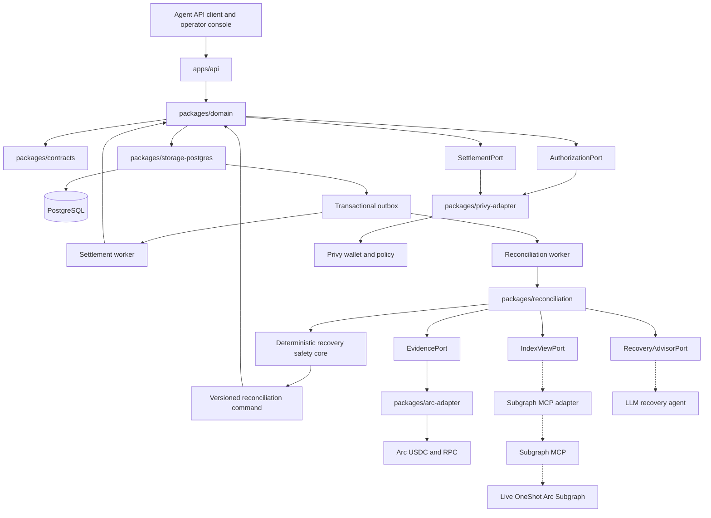
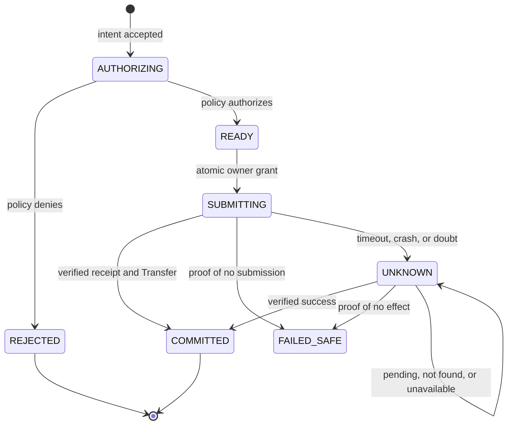

# OneShot

**One job. Many retries. One settlement.**

OneShot executes an approved business obligation exactly once, and keeps that
guarantee through retries, crashes, lost responses, queue redelivery, parallel
workers, and multiple agent instances.

The cardinality it protects is:

```text
1 Business Intent  /  N Attempts  /  at most 1 committed Settlement
```

## The problem

An autonomous agent is told to buy a paid API result for 1.25 USDC. It submits
the payment. The connection drops before the response arrives.

The agent now cannot tell the difference between:

- the payment never left, and
- the payment succeeded and the receipt was lost.

Retrying might pay twice. Not retrying might never pay at all. Most systems
guess. Guessing with money is how you get duplicate settlements.

OneShot refuses to guess. An uncertain outcome becomes a durable `UNKNOWN`
state that must be reconciled from authoritative evidence before anything else
happens. **Absence of proof that a payment happened is never treated as proof
that it did not.**

## How it works



Solid edges are implemented. Dashed edges are planned and not yet built.

### The state machine

Every Business Intent moves through durable, compare-and-set transitions. Only
one of them grants the right to touch the outside world.



`UNKNOWN` never grants permission to submit again. It is resolved by evidence
or escalated to a human.

## Design rules

These are enforced in code and tests, not by convention:

- **A stable `business_intent_id` survives everything.** Retries, restarts,
  redelivery, and parallel workers all converge on the same intent.
- **One atomic transition grants submission ownership.** Exactly one worker
  crosses the external boundary.
- **Doubt fails closed.** A timeout, reset, truncated response, or any
  unrecognized error is treated as *possibly submitted*, never as a safe retry.
- **A successful receipt is not confirmation.** Settlement is committed only
  when the receipt carries exactly one matching ERC-20 Transfer, to the expected
  recipient, for the exact amount, from the configured token.
- **Money is integer atomic units and `bigint`.** No JavaScript floating point
  touches a monetary value anywhere.
- **External indexes are evidence, never authority.** An empty or delayed index
  result cannot authorize a payment.

## Integrations

| System | Role |
| --- | --- |
| **Privy** | Corporate wallet, scoped authorization, and spending policy |
| **Arc** | USDC settlement rail (Arc Testnet, chain `5042002`) |
| **The Graph** | Planned candidate discovery when a transaction hash is lost |

Privy authorizes and constrains the wallet action. It is not the duplicate
lock: OneShot's durable state is.

## Repository layout

```text
apps/api                      HTTP seam
apps/worker                   settlement and reconciliation workers
packages/contracts            frozen v1 contract pack, OpenAPI, fixtures
packages/domain               intent, attempt, and settlement state
packages/storage-postgres     durable ledger and migrations
packages/arc-adapter          Arc profiles, money, receipts, readiness
packages/privy-adapter        authorization, requests, policy, adapters
packages/reconciliation       recovery evidence and safety core
packages/testkit-*            simulators and sanitized fixtures
```

## Quick start

Requires Node `24.19.0`, pnpm `11.19.0`, and PostgreSQL for integration tests.

```bash
pnpm install
pnpm lint && pnpm typecheck && pnpm build
pnpm test
```

Integration tests need a database:

```bash
pnpm test:integration
```

Copy `.env.example` to `.env` and fill in placeholders. Never commit a real
secret; see `docs/settlement/SETTLEMENT_CONFIG_V1.md` for how each variable is
classified.

To verify a configured Arc endpoint really is the chain and token you think it
is:

```bash
pnpm --filter @oneshot/arc-adapter probe
```

That command is read-only. It cannot sign, send, or mutate anything.

## API

| Method | Path | Purpose |
| --- | --- | --- |
| `POST` | `/v1/intents` | Create an intent; an identical replay returns the same result |
| `GET` | `/v1/intents/{id}` | Authoritative intent, attempts, settlement, evidence |
| `POST` | `/v1/intents/{id}/reconcile` | Trigger read-only reconciliation; never submits |
| `GET` | `/v1/intents/{id}/recovery-view` | Local authority plus labelled provider observations |
| `GET` | `/v1/metrics` | Operational metrics |
| `GET` | `/health/live` | Process liveness |
| `GET` | `/health/ready` | Configuration and Arc identity readiness |

The contract is defined in `packages/contracts/openapi/openapi.v1.json`.

## Project status

Under active development. **Testnet only.**

| Area | Status |
| --- | --- |
| Durable intent ledger, API, worker | Implemented |
| Settlement adapters and error taxonomy | Implemented, exercised against simulators |
| Recovery evidence and safety core | In progress |
| Subgraph MCP discovery and LLM recovery agent | Planned |
| Operator frontend | Not started |

**No live settlement has been executed.** No Privy application, wallet, policy,
or funded testnet account has been provisioned for this build. The adapters are
proven against simulators and sanitized fixtures, which demonstrates the logic
and not the providers' behaviour. The Privy and Arc integrations are therefore
`NOT VERIFIED`; see `docs/settlement/LIVE_EVIDENCE.md`.

Arc Mainnet is not configured. Its profile carries no chain ID, RPC, explorer,
or token value by design, and enabling it requires published official values
plus explicit human authorization.

## Documentation

| Document | Contents |
| --- | --- |
| [`plan.md`](plan.md) | Product plan, scope, and delivery gates |
| [`docs/DOMAIN_ARCHITECTURE.md`](docs/DOMAIN_ARCHITECTURE.md) | Domain model and boundaries |
| [`milestones/CONTRACTS.md`](milestones/CONTRACTS.md) | Frozen v1 contract pack |
| [`docs/settlement/`](docs/settlement/) | Settlement config, provider setup, live evidence |
| [`AGENTS.md`](AGENTS.md) | Contribution policy and review gates |

## License

MIT. See [`LICENSE`](LICENSE).
