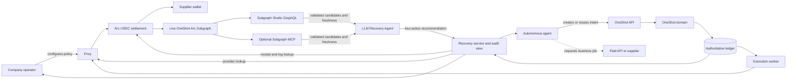
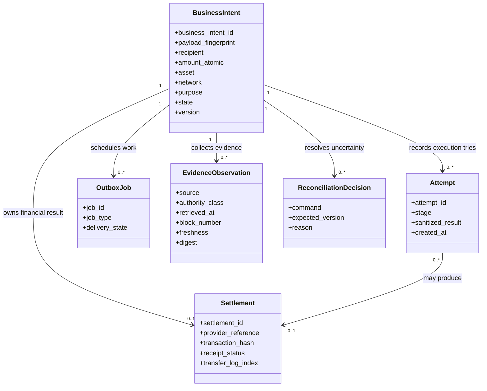
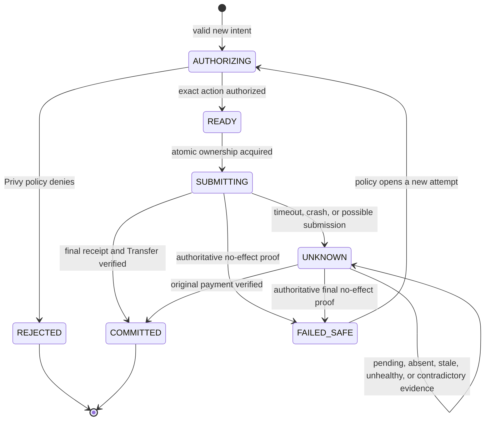
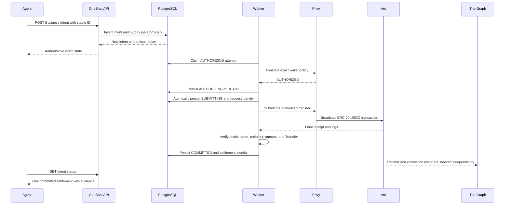
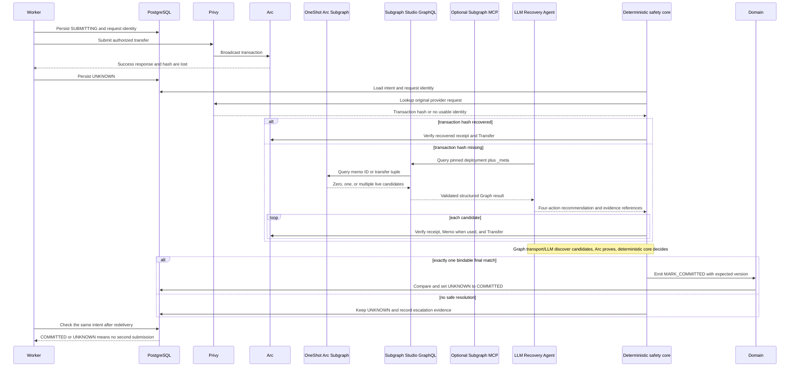
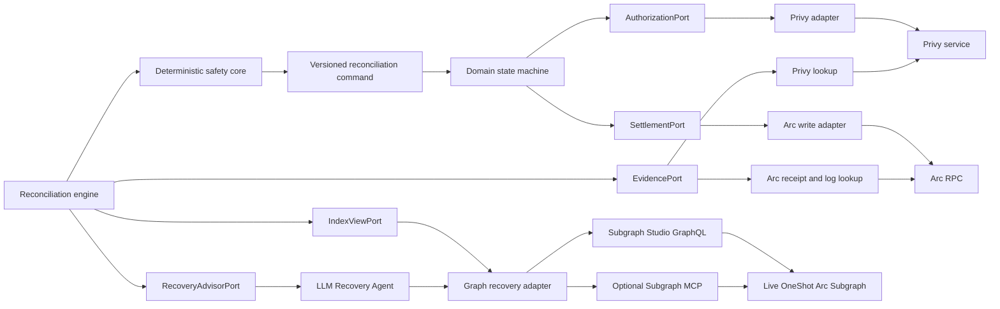
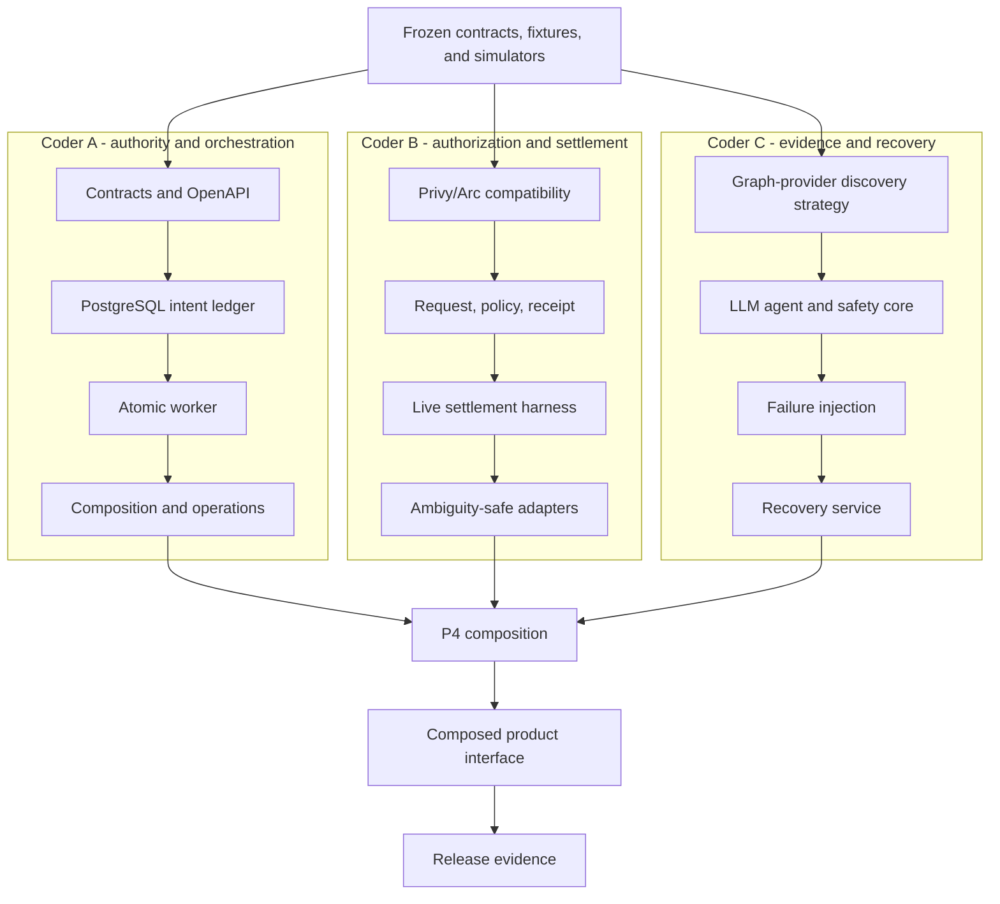

# OneShot Domain Architecture

This document explains how each domain part contributes to the product promise:

`1 Business Intent / N Attempts / <= 1 committed Settlement`

## System context

The paid service and its result remain outside OneShot's trust boundary.
OneShot guarantees payment cardinality and evidence for an approved obligation;
it does not certify supplier quality or delivery.

## Domain records and relationships

The Business Intent is the durable business identity. Attempts may repeat.
Settlement cardinality is enforced against the Business Intent, never against
an HTTP request, worker process, queue delivery, or agent session.

## State ownership

Only the domain and PostgreSQL transition rules own these states. Privy, Arc,
optional indexers, queues, and UI components report facts or perform bounded actions;
none may reinterpret the state machine.

## Component responsibilities

| Part                               | Owns                                                                                         | Must never own                                           |
| ---------------------------------- | -------------------------------------------------------------------------------------------- | -------------------------------------------------------- |
| Agent API                          | Validation, create/replay/conflict response, status reads                                    | Direct settlement or retry permission                    |
| Contracts package                  | Shared schemas, ports, enums, money and identity rules                                       | Provider implementation                                  |
| Domain package                     | State transitions, submission ownership, result classification                               | Network calls or UI                                      |
| PostgreSQL storage                 | Durable uniqueness, versions, attempts, settlement and evidence records                      | Business decisions outside domain commands               |
| Transactional outbox               | Atomic creation of work with domain state                                                    | Duplicate-payment prevention by itself                   |
| Graphile Worker                    | Deliver execution and reconciliation jobs                                                    | Authority to pay because a job was redelivered           |
| Privy adapter                      | Wallet authorization, policy checks, provider request identity                               | Durable Business Intent authority                        |
| Arc adapter                        | Transaction construction, submission, receipt and Transfer verification                      | Deciding whether another attempt is allowed              |
| The Graph Subgraph                 | Indexed transfer discovery, deployment identity, freshness, and health after passing C01     | Proof that an absent payment never happened              |
| Graph provider adapter             | Pin deployment and validate Studio GraphQL or optional MCP results before model use         | Model behavior, settlement authority, or secret exposure |
| LLM Recovery Agent                 | Recommend `WAIT`, `RECONCILE`, `ESCALATE`, or `RETURN_EXISTING_RESULT` from labeled evidence | Settlement submission or authoritative transition        |
| Deterministic recovery safety core | Recheck Arc/durable proof and map allowed recommendations to safe commands                   | Trusting Graph/MCP/model as financial authority          |
| Operator console                   | Explain state, evidence, policy and safe recovery actions                                    | Force-pay or bypass controls                             |
| Telemetry/runbooks                 | Reveal failures, lag, `UNKNOWN` age and safe-disable state                                   | Secrets or mutation of financial truth                   |

## Successful settlement sequence

## Ambiguous submission and recovery

## Port and adapter boundary

The domain consumes stable result families. Adapters translate external SDK,
RPC, MCP, Graph-query, and model behavior into those results. The safety core
accepts only the frozen four-action recommendation contract and independently
validates any result-returning command. External response shapes never leak
into the state machine.

## A/B/C ownership and convergence

Each coder closes backend packets against frozen simulators. P4 is where exact
reviewed packages replace simulators. Integration failures return to the owning
lane instead of producing shared ad hoc edits.
