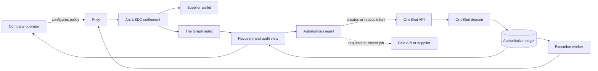
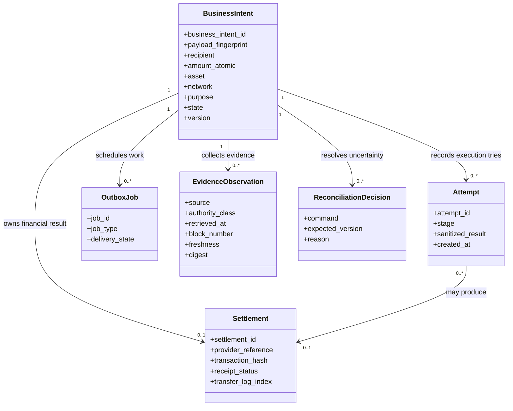
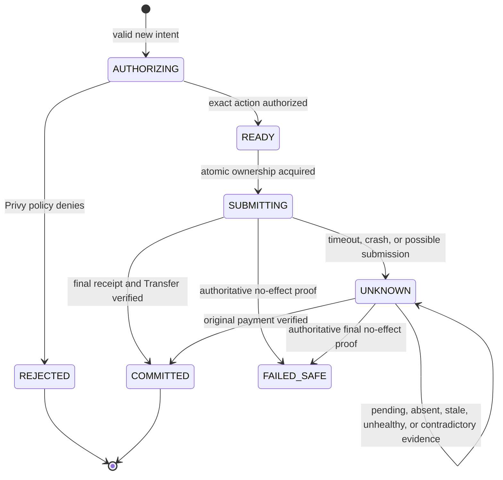
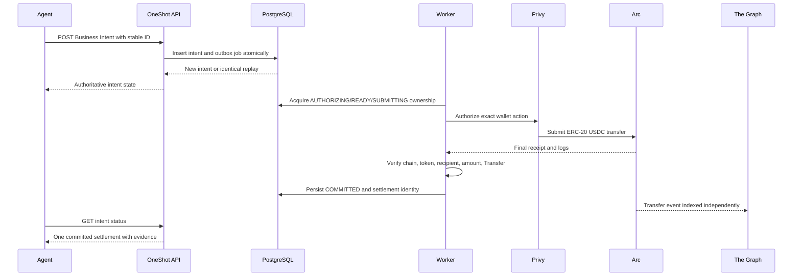
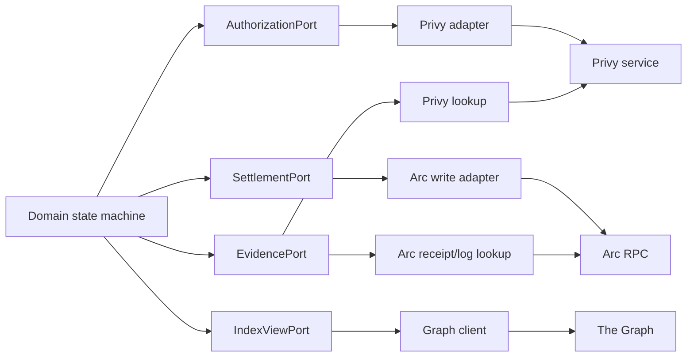
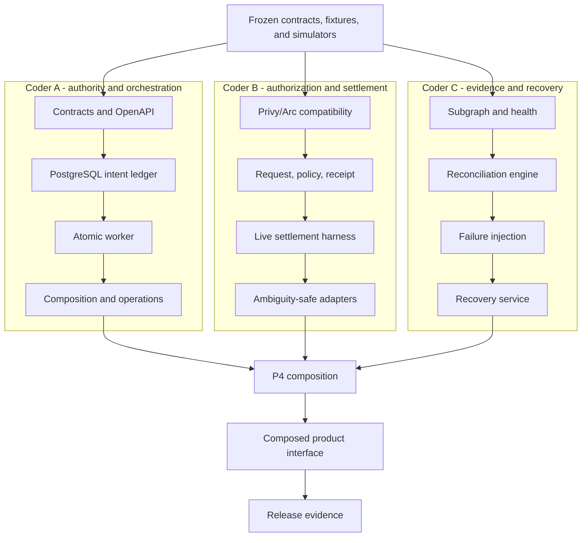

# OneShot Domain Architecture

This document explains how each domain part contributes to the product promise:

`1 Business Intent / N Attempts / <= 1 committed Settlement`

## System context



The paid service and its result remain outside OneShot's trust boundary.
OneShot guarantees payment cardinality and evidence for an approved obligation;
it does not certify supplier quality or delivery.

## Domain records and relationships



The Business Intent is the durable business identity. Attempts may repeat.
Settlement cardinality is enforced against the Business Intent, never against
an HTTP request, worker process, queue delivery, or agent session.

## State ownership



Only the domain and PostgreSQL transition rules own these states. Privy, Arc,
The Graph, queues, and UI components report facts or perform bounded actions;
none may reinterpret the state machine.

## Component responsibilities

| Part | Owns | Must never own |
| --- | --- | --- |
| Agent API | Validation, create/replay/conflict response, status reads | Direct settlement or retry permission |
| Contracts package | Shared schemas, ports, enums, money and identity rules | Provider implementation |
| Domain package | State transitions, submission ownership, result classification | Network calls or UI |
| PostgreSQL storage | Durable uniqueness, versions, attempts, settlement and evidence records | Business decisions outside domain commands |
| Transactional outbox | Atomic creation of work with domain state | Duplicate-payment prevention by itself |
| Graphile Worker | Deliver execution and reconciliation jobs | Authority to pay because a job was redelivered |
| Privy adapter | Wallet authorization, policy checks, provider request identity | Durable Business Intent authority |
| Arc adapter | Transaction construction, submission, receipt and Transfer verification | Deciding whether another attempt is allowed |
| The Graph Subgraph/client | Indexed transfer history, deployment identity, freshness and health | Proof that an absent payment never happened |
| Reconciliation engine | Combine bound evidence and emit versioned safe commands | Settlement submission |
| Operator console | Explain state, evidence, policy and safe recovery actions | Force-pay or bypass controls |
| Telemetry/runbooks | Reveal failures, lag, `UNKNOWN` age and safe-disable state | Secrets or mutation of financial truth |

## Successful settlement sequence



## Ambiguous submission and recovery

```mermaid
sequenceDiagram
    participant Worker
    participant DB as PostgreSQL
    participant Privy
    participant Arc
    participant Reconciler
    participant Graph as The Graph

    Worker->>DB: Persist SUBMITTING and request identity
    Worker->>Privy: Submit authorized transfer
    Privy->>Arc: Broadcast transaction
    Arc--xWorker: Success response is lost
    Worker->>DB: Persist UNKNOWN
    Reconciler->>DB: Load intent, request identity, and observations
    Reconciler->>Privy: Lookup original provider request
    Reconciler->>Arc: Lookup exact transaction receipt and Transfer
    Reconciler->>Graph: Query indexed observation plus freshness
    Note over Reconciler,Graph: Graph may locate or corroborate activity but cannot authorize a retry
    Reconciler->>DB: MARK_COMMITTED when exact Arc success is verified
    DB-->>Worker: Redelivery observes terminal state; no second submission
```

## Port and adapter boundary



The domain consumes stable result families. Adapters translate external SDK,
RPC, and GraphQL behavior into those results. External response shapes never
leak into the state machine.

## A/B/C ownership and convergence



Each coder closes backend packets against frozen simulators. P4 is where exact
reviewed packages replace simulators. Integration failures return to the owning
lane instead of producing shared ad hoc edits.
