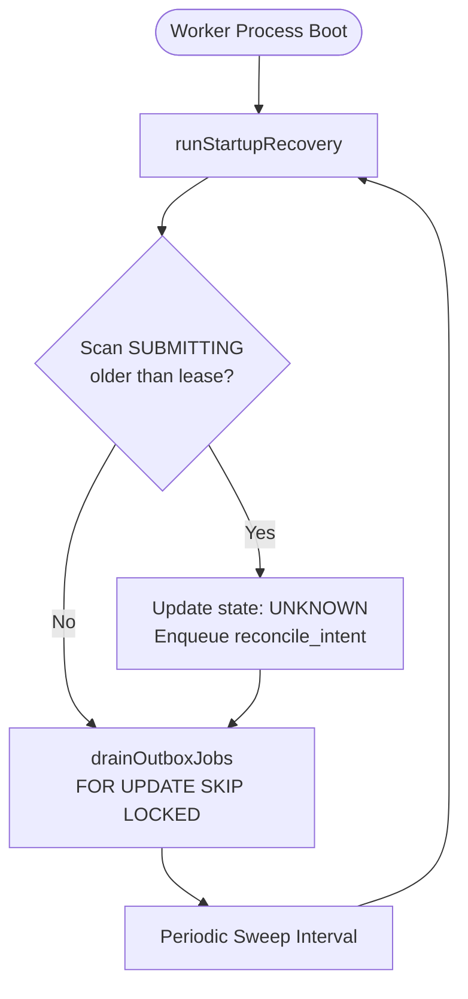

# OneShot Restart Runner and Recovery Architecture

## Overview

The Restart Runner (`@oneshot/worker/restart-runner`) guarantees that the OneShot backend survives ungraceful process crashes, worker container restarts, network partitions, and database failovers without violating financial invariants.

## Key Invariants Under Restart

1. **At-Most-Once Settlement**: An intent can produce at most one confirmed on-chain settlement transaction regardless of how many times a worker process restarts during execution.
2. **Fail-Closed Lease Expiry**: If a worker crashes while an intent is in `SUBMITTING`, lease expiry moves the intent to `UNKNOWN` and requires reconciliation. It is strictly forbidden to grant a new submission claim upon restart.
3. **Outbox Idempotency**: Pending transactional outbox jobs (`authorize_intent`, `submit_settlement`, `reconcile_intent`) are resumed safely using `FOR UPDATE SKIP LOCKED`.

## Recovery Lifecycle

## Methods

- `runStartupRecovery(options, leaseDurationMs)`: Scans for orphaned `SUBMITTING` records older than the lease threshold (default 30 seconds), transitions them to `UNKNOWN`, and enqueues a `reconcile_intent` outbox job.
- `resumeSafeJobs(options, maxJobs)`: Combines startup recovery and outbox draining in one call.
- `RestartRunner.start()`: Runs startup recovery on initialization and starts a non-blocking background timer for ongoing lease enforcement.
