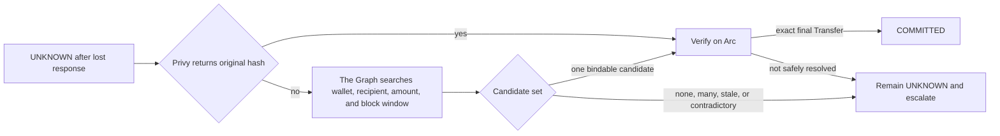
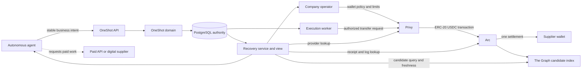
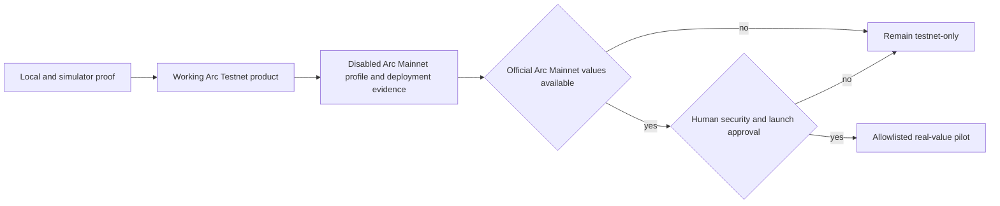
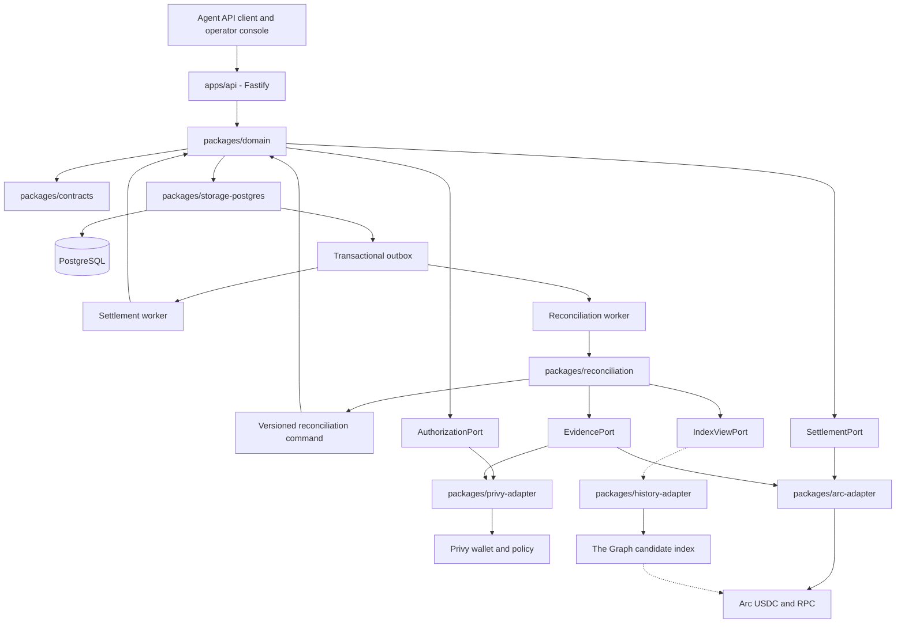
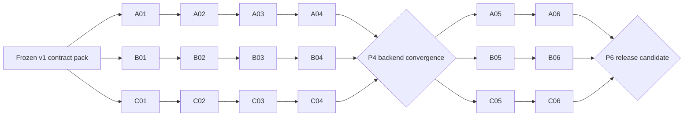

# OneShot Product Delivery Plan

Status: working testnet MVP and mainnet-readiness roadmap
Team: exactly three coders
Implementation base: the human-approved commit containing this plan
Research basis: `.agent/research/20260906-integration-decisions.md`
Detailed work packets: [`milestones/README.md`](milestones/README.md)
Domain architecture: [`docs/DOMAIN_ARCHITECTURE.md`](docs/DOMAIN_ARCHITECTURE.md)

## Global product vision

OneShot is a payment control plane for autonomous business agents. It lets a
company approve one business obligation, allow an agent to execute it, and
retain one durable financial outcome even when requests, processes, workers,
or agent instances repeat.

The primary product promise is:

`One job. Many retries. One settlement.`

The first production vertical is a B2B agent purchasing a paid API operation
or digital result in USDC. Invoice payment, procurement, subscriptions, and
other agent-commerce obligations are later verticals built on the same
Business Intent contract.

## Primary product flow

1. A company configures a Privy-controlled wallet, recipient policy, and
   spending limit.
2. An agent creates one Business Intent for a paid API job with a stable
   identity, recipient, amount, asset, network, and purpose.
3. OneShot validates and durably records the obligation before any external
   effect.
4. A worker obtains atomic submission ownership and asks Privy to authorize the
   exact Arc USDC transfer.
5. Arc settles the payment. OneShot verifies the receipt and expected ERC-20
   Transfer before recording `COMMITTED`.
6. A timeout, crash, or lost response becomes durable `UNKNOWN`. Reconciliation
   first asks Privy for the original transaction identity. When the hash is
   missing, The Graph searches live indexed transfers for candidates; Arc then
   verifies each candidate receipt and exact Transfer. No candidate, multiple
   candidates, stale data, or contradiction leaves the intent `UNKNOWN`.
7. Repeated HTTP requests, queue deliveries, processes, or agents return the
   same Business Intent and cannot create a second committed settlement.

## Sponsor and product configuration

The primary product configuration is **Privy + Arc + The Graph**:

- Privy authorizes and constrains the corporate wallet action.
- The Graph discovers candidate transfers when a successful submission lost its
  transaction hash or provider response.
- Arc verifies the candidate receipt and exact USDC `Transfer`.
- OneShot and PostgreSQL alone decide the durable state transition.

This is the final implementation direction. The Graph is load-bearing for
automatic hashless discovery, but never becomes settlement authority. C01 must
prove its live data, freshness, and candidate-selection behavior before the
sponsor claim is made.

The Graph submission targets the AI Tooling or AI Use Case track. One custom
Subgraph does not satisfy the Composable/Standardized track. The recovery agent
uses live Graph data to choose and explain candidates; deterministic Arc checks
and the OneShot state machine retain all financial authority.



The Graph discovers candidates, not truth. Arc RPC can also scan logs without a
hash, so Graph is not mathematically indispensable; it is the selected product
dependency for fast, structured, automatic recovery. Empty, lagging, unhealthy,
or multiple candidate results keep the intent `UNKNOWN`.

The preferred correlation spike uses Arc's official Memo contract:
`memoId = hash(business_intent_id)`. The Graph indexes the Memo event and linked
USDC Transfer, then Arc verifies their shared transaction and exact calldata.
B01 must prove Privy policy can restrict the Memo destination, forwarded USDC
target, and required business parameters. If it cannot, preserve the stricter
policy and use tuple/window candidate search for the demo or a narrow typed
settlement contract; never weaken authorization to obtain a cleaner lookup.

## Product surfaces

| Surface | User | Purpose |
| --- | --- | --- |
| Agent API and generated client | Autonomous agent or backend | Create/reuse a Business Intent and read its authoritative state |
| Operator console | Company operator | Inspect attempts, policy decisions, settlement evidence, and recovery state |
| Execution worker | OneShot service | Acquire submission ownership and execute the approved settlement |
| Reconciliation service | Agent and operator | Resolve ambiguous outcomes without blindly paying again |
| Audit and recovery timeline | Company and supplier | Explain what happened, which evidence is authoritative, and what action is safe |



OneShot controls payment cardinality. It does not guarantee the quality or
delivery of the supplier's API result; that remains a separate commercial
contract.

## Production roadmap model

- The roadmap targets a working Arc Testnet product plus a mainnet-ready deployment path.
- Work is ordered by domain dependencies and evidence gates.
- A, B, and C progress independently inside frozen contracts and converge only
  through reviewed package entry points, fixtures, and simulators.
- A phase advances when its exit evidence passes; a packet advances when its
  local acceptance contract passes.
- Frontend production work begins after backend convergence freezes the public
  API and recovery semantics.

## 1. Mission and v1 release

Deliver a working application that accepts one approved Business Intent, survives retries, crashes, duplicate delivery, parallel workers, and ambiguous provider responses, and produces at most one committed USDC settlement on Arc Testnet through a Privy-controlled corporate wallet. The same build must include a fail-closed Arc Mainnet profile, deployment and rollback procedure, and readiness evidence so official mainnet values can be enabled without redesigning the domain. Known-identity recovery uses OneShot, Privy, and direct Arc evidence; hashless automatic recovery uses The Graph for candidate discovery after C01 proves live value and sponsor fit.

The release claim is:

`1 Business Intent / N Attempts / <= 1 committed Settlement`

The delivery plan is backend-first. Frontend implementation is deliberately placed in Phase R5 and may start only after the backend contract-freeze gate has passed.

## 2. Planning objectives

This plan optimizes for five properties:

1. Safety: uncertainty never becomes permission to pay again.
2. Independent progress: no coder waits for another coder’s implementation to close a work packet.
3. Low merge contention: each coder owns disjoint directories and shared files have a single editor.
4. Verifiable handoffs: ports, OpenAPI, schemas, fixtures, and simulators are versioned artifacts.
5. Late frontend: UI work consumes a stable backend contract instead of driving it.
6. Network promotion: testnet proves behavior; mainnet readiness proves the same boundaries can be configured safely when Arc publishes official production values.

## 3. Product success criteria

- Identical requests reuse the same durable Business Intent; conflicting payloads under the same ID fail explicitly.
- Privy authorization constrains every normal settlement path. Wrong network, token, method, recipient, value, or above-cap amount produces zero settlement.
- A valid intent can produce one real ERC-20 USDC transfer on Arc Testnet and persist a verified receipt and Transfer identity.
- A timeout, disconnect, lost response, or crash after possible submission produces durable `UNKNOWN`; a new payment is forbidden until authoritative reconciliation resolves it.
- Ten sequential retries, ten parallel workers, restart recovery, queue redelivery, and two agent instances never produce more than one committed settlement.
- Privy/direct Arc lookup resolves known transaction identities. The Graph enables automatic hashless candidate discovery; its absence, delay, multiple matches, or contradiction never authorizes payment.
- Money remains a canonical integer string at JSON boundaries and `bigint` internally, using six-decimal ERC-20 USDC atomic units.
- The demo proves working Privy and Arc integrations with sanitized testnet evidence and no exposed secrets.
- A mainnet-readiness check proves network, token, explorer, policy, deployment, rollback, and safe-disable configuration fail closed while official Arc Mainnet values remain disabled until published and human-approved.
- The Graph sponsor claim is retained only when live evidence proves hashless discovery and meaningful recovery-agent automation beyond direct known-hash lookup.

## 4. Scope

### Included

- Strict TypeScript monorepo, shared contracts, API, worker, PostgreSQL state, migrations, and transactional jobs.
- Privy execution-wallet authorization and fail-closed wallet policy.
- Arc Testnet ERC-20 USDC request construction, submission, receipt verification, and explorer evidence.
- Durable reconciliation using OneShot state, Privy identifiers/status, and direct Arc RPC receipts/logs.
- Provider-neutral candidate-index port, The Graph deployment/health contract, and freshness/multiple-candidate classification.
- Contract simulators, failure injection, concurrency and restart testing, structured logs, metrics, and operator runbooks.
- Minimal operator/user frontend after backend acceptance.
- Arc Mainnet configuration seam, deployment manifest, readiness probe, safe-disable and rollback runbooks, with real-value execution disabled until official values and explicit human authorization exist.

### Excluded

- Actual mainnet value transfer before Arc publishes official production access/addresses and a human authorizes the operation; additional chains/assets, swaps, bridges, fiat rails, automatic transaction replacement, and unrestricted payment overrides.
- Any external indexer as duplicate lock, durable intent store, or proof that another settlement is safe.
- General workflow automation, arbitrary supplier/ERP integrations, native mobile clients, production compliance certification, or multi-region HA.
- UI polish that is not necessary to demonstrate the invariant and sponsor requirements.

### Post-MVP production path

The implementation commitment includes a working testnet MVP and mainnet-ready
deployment artifacts. Real-value activation remains a separate human-controlled gate:

1. **Mainnet activation:** pin official Arc Mainnet chain, RPC, explorer, USDC and contract identities; rerun compatibility, security, rollback, and safe-disable checks; require explicit human authorization.
2. **Limited production pilot:** add tenant authorization, retention/deletion policy, backup/restore proof, allowlisted organizations, conservative spending caps, incident response, monitoring, and staged rollout with no automatic migration of testnet state.
3. **Product expansion:** invoice and procurement connectors, subscriptions,
   supplier APIs, additional settlement networks/assets, and higher-availability
   deployment only after the core invariant remains proven in the pilot.

P0-P6 delivers testnet functionality and mainnet readiness. Actual production activation and real-value pilot execution remain outside automatic agent authority.
### Deployment path



Testnet proves product behavior. Mainnet readiness proves configurability,
deployment, safe disable, and rollback. It never grants an agent permission to
activate real-value execution.

## 5. Fixed technical baseline

| Area | Technology and decision |
| --- | --- |
| Runtime | Current active Node.js LTS, pinned by A01, with strict TypeScript |
| Workspace | `pnpm` monorepo with package-local lint, type, test, and build commands |
| API and contracts | Fastify HTTP JSON API, JSON Schema, OpenAPI source of truth, and generated-client/schema drift checks |
| Authoritative state | PostgreSQL, explicit SQL migrations, `pg`, uniqueness constraints, compare-and-set transitions, and transactional outbox records |
| Work delivery | Graphile Worker over the same PostgreSQL database; at-least-once delivery is assumed |
| EVM encoding and RPC | `viem` for typed addresses, calldata, chain access, receipt reads, and log verification |
| Authorization | Privy Node SDK, execution wallet, scoped wallet policy, persisted idempotency key, and reference identity |
| Settlement profiles | Arc Testnet `eip155:5042002` and its official USDC interface are enabled for live proof; the Arc Mainnet profile is structurally complete but disabled until official chain/token values are published, pinned, verified, and human-approved |
| Hashless discovery | `IndexViewPort` is provider-neutral; The Graph is the selected v1 adapter for live candidate discovery. C01 must prove the lost-hash flow, freshness, degradation behavior, and AI-track fit; direct RPC remains the safe fallback |
| Money | Canonical integer strings at JSON boundaries and `bigint` internally; no JavaScript monetary floats |
| Frontend | React and Vite, generated OpenAPI client, exact integer amount formatting, and no direct settlement capability |
| Testing | Vitest for unit/contract tests, Testcontainers for PostgreSQL integration, Playwright for browser flows, deterministic failure simulators, and Graph adapter/degradation tests |
| Local and CI | Docker Compose for reproducible local services and GitHub Actions for install, lint, type, test, build, migration, contract, and policy checks |
| Submission jobs | One queue attempt; the task persists `COMMITTED`, `FAILED_SAFE`, or `UNKNOWN` before returning |
| Recovery authority | PostgreSQL state and verified Arc evidence are authoritative; Privy may locate the original request; The Graph supplies freshness-labeled candidates and never grants settlement permission |

Exact dependency versions are pinned only after A01/B01 compatibility spikes.
The exact v1 contracts, state table, fixture catalog, redaction rules, and change
protocol are frozen in [`milestones/CONTRACTS.md`](milestones/CONTRACTS.md).

## 6. Architecture



OneShot decides whether settlement may be attempted. Privy constrains authorized wallet actions. Arc provides final settlement evidence. Direct Privy/Arc lookup resolves known transaction identities. The Graph is the selected automatic discovery path when that identity is lost; it proposes candidates but grants no settlement right. Detailed entity, state, sequence, and ownership diagrams live in [`docs/DOMAIN_ARCHITECTURE.md`](docs/DOMAIN_ARCHITECTURE.md).

## 7. Team topology and exclusive ownership

### Coder A — domain and orchestration

Owns:

- `packages/contracts`
- `packages/domain`
- `packages/storage-postgres`
- `packages/testkit-domain`
- `apps/api`
- `apps/worker`
- root workspace/build configuration after the initial scaffold
- migrations and OpenAPI

Coder A never implements provider-specific Privy, Arc, or external-index behavior.

### Coder B — authorization and settlement adapters

Owns:

- `packages/privy-adapter`
- `packages/arc-adapter`
- `packages/testkit-settlement`
- Privy policy and official-response fixtures
- Arc network, transaction, and receipt validation
- human-run provider setup documentation

Coder B never changes domain tables or state meanings directly.

### Coder C — reconciliation and recovery evidence

Owns:

- `packages/reconciliation`
- optional `packages/history-adapter` after the C01 decision
- `packages/testkit-failures`
- `subgraph/` after The Graph passes the C01 live discovery and qualification gate
- recovery-view schemas and queries
- failure matrix orchestration and recovery runbooks

Coder C issues state commands only through the frozen reconciliation command contract.

### Shared-file rule

- Coder A is the sole editor of root workspace files, root scripts, OpenAPI, and migrations after scaffold freeze.
- B and C provide package-local manifests, fixtures, and integration notes; A composes them through additive root changes.
- A shared contract change is additive first. Removal occurs only after all consumers have migrated.
- No package imports another owner’s implementation package. Cross-track use occurs through contracts, fixtures, simulators, or published package entry points.

## 8. Independence model

### 8.1 Work-packet closure

Each file under `milestones/coder-a`, `milestones/coder-b`, or `milestones/coder-c` is an independently closable milestone. A coder closes it when its local acceptance criteria, package checks, handoff artifact, and review requirements pass. Closure never requires another coder’s branch, approval, credentials, service, or unfinished implementation.

### 8.2 Allowed prerequisites

A work packet may depend only on:

- the frozen v1 contract pack in `milestones/CONTRACTS.md`;
- committed fixtures or simulators included in that contract pack;
- the same coder’s immediately preceding packet;
- human-provided credentials only for explicitly marked live-evidence checks, with an offline fixture path that still allows packet closure.

Cross-coder artifacts are integration inputs, never closure prerequisites. If a real artifact is unavailable, the consumer uses the versioned simulator and records final live verification under a project gate.

### 8.3 No-wait continuation rule

When a coder closes a packet, they immediately begin their next packet. They do not wait for a global milestone meeting. A broken cross-track contract opens a small additive compatibility ticket; it does not freeze unrelated work.

### 8.4 Contract packs

Every producer publishes a package-local contract pack containing:

- version and compatibility range;
- TypeScript types or JSON Schema;
- one happy-path fixture and every relevant terminal/error fixture;
- deterministic simulator;
- package-local verification command;
- redaction statement;
- short migration note for additive changes.

Consumers validate against the pack, not against a producer’s active branch.

### 8.5 Async communication

- Each PR description is the handoff record: outcome, immutable contract version, commands, evidence, risks, and safe-disable behavior.
- Questions default to a written assumption plus a fail-closed implementation. Only decisions that could weaken settlement cardinality, money representation, authorization, or `UNKNOWN` handling require synchronous escalation.
- Daily status is informational and never an approval gate.

## 9. Delivery phases and dependency gates

The three lanes run in parallel. Phase order expresses dependency and product
readiness only. A lane may begin its next packet as soon as its own acceptance
contract passes.

| Phase | Entry condition | Coder A | Coder B | Coder C | Exit evidence |
| --- | --- | --- | --- | --- | --- |
| R0 — product and contract freeze | Product vertical selected | Confirm domain/API contract | Confirm provider/chain contract | Confirm recovery/evidence contract | P0 approved scope and immutable v1 pack |
| R1 — independent foundations | P0 | A01 | B01 | C01 | P1 runnable toolchains and recorded compatibility findings |
| R2 — durable core and adapters | Own R1 packet | A02 | B02 | C02 | P2 compatible contract packs and simulators |
| R3 — safety under failure | Own R2 packet | A03 | B03 | C03 | P3 concurrency, ambiguity, and failure proofs |
| R4 — backend convergence | A03/B03/C03 artifacts available | A04 and composition owner | B04 and live settlement evidence | C04 and live recovery evidence | P4 integrated backend, one real settlement, lost-response recovery |
| R5 — product interface | P4 | A05 application shell | B05 policy/settlement slice | C05 recovery/history slice | P5 composed operator experience |
| R6 — hardening and release | P5 | A06 operations/mainnet-readiness bundle | B06 Privy/Arc evidence and network profiles | C06 Graph discovery/recovery evidence | P6 repeatable testnet release plus mainnet-readiness candidate |

Provider access, SDK incompatibility, or failed integration evidence opens an
owner-specific compatibility task. It never weakens the safety invariant or
silently changes a contract.

## 10. Work-packet inventory

| ID | Owner | Own-track prerequisite | Independently verifiable output |
| --- | --- | --- | --- |
| [A01](milestones/coder-a/A01-foundation-contracts.md) | A | Frozen contract pack | Workspace, contracts package, OpenAPI, domain simulator |
| [A02](milestones/coder-a/A02-durable-intents.md) | A | A01 | PostgreSQL intent/replay/conflict API |
| [A03](milestones/coder-a/A03-atomic-worker.md) | A | A02 | Atomic worker and at-most-once fake-port proof |
| [A04](milestones/coder-a/A04-restart-operations-composition.md) | A | A03 | Restart-safe orchestration and simulator composition |
| [A05](milestones/coder-a/A05-frontend-intent-status.md) | A | A04 + project Gate P4 | Intent/status frontend slice against mock server |
| [A06](milestones/coder-a/A06-release-operations.md) | A | A05 | Operational demo and release bundle |
| [B01](milestones/coder-b/B01-sdk-network-compatibility.md) | B | Frozen contract pack | SDK/network compatibility and readiness package |
| [B02](milestones/coder-b/B02-request-policy-receipt.md) | B | B01 | Canonical request, policy, and receipt verifier |
| [B03](milestones/coder-b/B03-live-settlement-harness.md) | B | B02 | Offline-complete plus live-ready settlement harness |
| [B04](milestones/coder-b/B04-ambiguity-integration.md) | B | B03 | Conservative outcomes and production adapter pack |
| [B05](milestones/coder-b/B05-frontend-settlement-details.md) | B | B04 + project Gate P4 | Authorization/settlement UI slice against fixtures |
| [B06](milestones/coder-b/B06-sponsor-evidence.md) | B | B05 | Privy/Arc sanitized evidence bundle |
| [C01](milestones/coder-c/C01-recovery-evidence-strategy.md) | C | Frozen contract pack | Recovery evidence contract and indexer value decision |
| [C02](milestones/coder-c/C02-reconciliation-engine.md) | C | C01 | Deterministic reconciliation and evidence contract |
| [C03](milestones/coder-c/C03-failure-injection.md) | C | C02 | Cross-source chaos and restart harness |
| [C04](milestones/coder-c/C04-recovery-matrix-integration.md) | C | C03 | Recovery matrix and simulator integration pack |
| [C05](milestones/coder-c/C05-frontend-recovery.md) | C | C04 + project Gate P4 | Recovery timeline UI slice against fixtures |
| [C06](milestones/coder-c/C06-qualification-demo.md) | C | C05 | Recovery and conditional-index qualification bundle |

Each packet contains smaller, one-commit-sized tasks, exact acceptance criteria, tests, output artifacts, and a no-wait continuation instruction.

## 11. Dependency graph



The lane arrows are same-owner dependencies. Gate P4 is the intentional
backend convergence point. A04/B04/C04 close against contract simulators; P4
replaces them with exact reviewed package entry points and live testnet
evidence before frontend work begins.

## 12. Project gates

Project gates coordinate the product but are not coder work-packet closure conditions.

### P0 — plan and contract approval

- Human accepts the product scope, v1 state machine, port semantics, ownership, fixture catalog, and test seams.
- The plan commit is present on the chosen implementation base.
- Each coder creates a worktree/branch from the same base SHA.

### P1 — independent toolchains

- A01, B01, and C01 each pass package-local checks without third-party credentials.
- Every lane can continue using only committed fixtures and simulators.
- SDK/tooling compatibility findings are recorded before contract-pack convergence.

### P2 — contract-pack compatibility

- A02, B02, and C02 contract packs validate against the frozen schemas.
- Drift checks show no breaking change.
- Any additive extension has a compatibility note and old fixture support.

### P3 — independent safety proofs

- A03 proves atomic submission ownership with a fake counter.
- B03 proves conservative provider outcomes offline and is ready for human-enabled testnet evidence.
- C03 proves missing, lagging, contradictory, and unavailable evidence cannot unlock payment.

### P4 — backend convergence and live proof

This is the frontend unlock gate.

- A composition branch replaces simulators with reviewed B and C package entry points.
- Root lint, type, unit, integration, contract, build, migration, concurrency, restart, and failure checks pass.
- The complete `.agent/TEST_MATRIX.md` records durable final state and external settlement count.
- One real allowed Arc Testnet payment commits exactly once through Privy.
- Wrong-scope and above-cap cases produce zero settlement.
- A lost-response scenario reaches `UNKNOWN` and reconciles to the original transaction without a duplicate.
- The lost-hash scenario uses live The Graph data to discover candidates, direct Arc evidence to verify the bound transaction, and no second submission; stale, empty, multiple, or contradictory candidates remain `UNKNOWN`.
- OpenAPI and recovery-view semantics are frozen for frontend.

### P5 — frontend acceptance

- A05, B05, and C05 compose against the frozen API.
- Browser tests cover create, replay, conflict, denial, committed, `UNKNOWN`, Graph discovery, Graph lag/error/multiple-candidate, and service-unavailable states.
- No force-pay or unguarded settlement action exists.
- Accessibility smoke, responsive layout, lint, type, build, and no-secret checks pass.

### P6 — release candidate

- A06, B06, and C06 evidence bundles compose into one repeatable testnet demo.
- The disabled Arc Mainnet profile passes configuration, deployment-manifest, readiness, safe-disable, and rollback checks without sending a mainnet transaction.
- Sponsor qualification cites working code, tests, live evidence, network, and limitations.
- Safe-disable and recovery runbooks work without manual database surgery.
- Exact candidate tree passes repository checks and mandatory independent review gates before human merge.

## 13. Test ownership

| Required case | Producer | Independent local proof | Project-gate proof |
| --- | --- | --- | --- |
| Normal job | A | Domain fake settlement counter | P4 real adapter |
| Same request twice | A | HTTP + PostgreSQL | P4 composed worker |
| Conflicting payload, same ID | A | HTTP + PostgreSQL | P4 recovery view |
| 10 sequential retries | A | Worker + fake port | P4 adapter call count |
| 10 parallel workers | A | Real PostgreSQL concurrency | P4 composed worker |
| Crash before submission | A | Worker kill point | P4 zero external settlement |
| Crash after possible submission | B | Adapter fault fixture | P4 durable `UNKNOWN` |
| Lost payment response | B | Proxy/fixture | P4 original transaction reconciled |
| Graph delay/absence/multiple candidates | C | Provider-neutral Graph simulator | P4 remain `UNKNOWN`; no submission grant |
| Privy denial/above cap | B | Policy fixture/live-ready harness | P4 zero settlement |
| Service restart | A | Process orchestration | P4 evidence durability |
| Downstream failure after payment | A | Supplier fake | P4 original receipt retained |
| Two agent instances | A | Two processes + fake counter | P4 single settlement history |

## 14. Frontend-last rule

No production frontend implementation begins before Gate P4. Prior to P4, coders may only define JSON fixtures, OpenAPI examples, and non-production mock-server behavior needed to test backend contracts. They may not build screens, components, styling, or browser flows.

After P4, the three frontend packets remain independent:

- A05 owns application shell, create/replay/conflict, and authoritative status.
- B05 owns policy, authorization, transaction, and explorer details.
- C05 owns recovery timeline, evidence provenance, Graph freshness/candidate state, and escalation.

Each slice is built against the frozen mock server. Final composition is a project gate, not a packet closure requirement.

## 15. Branch and merge strategy

- One packet equals one short-lived branch and focused PR, for example `milestone/a01-foundation-contracts`.
- Branch from the recorded implementation-base SHA. A coder’s next branch may start from their own previous approved packet without waiting for unrelated lanes.
- Never mix two owners’ directories in one packet PR.
- Contract changes use expand-migrate-contract: add new form, retain old form, migrate consumers independently, then remove old form in a separate task.
- Coder A owns root composition and resolves shared/root conflicts. B and C never edit root files simply to make local tooling work; they use package-local commands.
- Each implementation change follows `.agent/IMPLEMENTATION_LOOP.md`. Agents do not merge PRs.

## 16. Human-only external configuration

Coder B produces a repeatable setup guide or wizard, but a human performs Privy application/wallet/key-quorum/policy creation, Arc Testnet funding, any selected index-provider credential entry, Mainnet profile activation, and CI-secret configuration.

- Secret input is hidden and written only to ignored runtime files or approved secret stores.
- Public network, contract, deployment, and policy identifiers are separated from secrets.
- Policy replacement, ownership change, funding, deployment, or other external mutation requires explicit confirmation.
- Offline fixtures keep all coder packets closable when credentials or services are unavailable.
- Agents never paste secrets into context records, reviews, logs, fixtures, or PRs.

## 17. Observability and operations

- Correlation fields: Business Intent ID, Attempt ID, settlement version, Privy reference/transaction ID, Arc transaction hash, active network profile, and Graph deployment/observed block.
- Never log signatures, credentials, private keys, raw authorization bodies, or private wallet material.
- Metrics: intent states, oldest/count `UNKNOWN`, transition conflicts, queue lag, reconciliation outcomes, policy denials, provider/RPC errors, Graph lag/health/candidate count, duplicate and conflict counts.
- Safe disable stops new submission ownership while preserving status, evidence ingestion, and reconciliation reads.
- Operators inspect durable identity and evidence. There is no generic retry or force-pay button.

## 18. Risk controls

| Risk | Fail-closed mitigation | Owner |
| --- | --- | --- |
| Privy idempotency expires | PostgreSQL uniqueness remains authoritative; reuse stored key/body only as supplemental guard | A/B |
| SDK or policy syntax changes | B01 pins after compatibility proof; readiness validates policy identity and network | B |
| ERC-20/native precision confusion | Six-decimal ERC-20 is the only settlement amount; native balance is gas only | B/C |
| Lost response after broadcast | Persist identity first, enter `UNKNOWN`, reconcile, forbid another payment | All |
| Pending/evicted Arc transaction | Hold `UNKNOWN`; no automatic replacement in v1 | B/C |
| Graph lag/error/empty/multiple result | Surface freshness and candidate ambiguity; never infer non-payment | C |
| Queue redelivery | Domain CAS/constraints plus single-attempt submission task | A |
| Shared-file conflicts | Exclusive path ownership and A-only root composition | A |
| Credentials unavailable | Offline contract packs and simulators remain sufficient for packet closure | B |
| Scope pressure | Cut webhooks, rolling policy support, visual polish, and optional telemetry before safety | All |

## 19. Definition of done for every packet

- Scope, non-goals, consumed contract version, and acceptance criteria are explicit.
- The smallest public-seam test is written first and passes with the implementation.
- Package-local format, lint, type, test, and build commands pass where present.
- Payment/retry work asserts durable state and external settlement count.
- Boundary validation, integer money, redaction, testnet restriction, and safe-disable impact are covered.
- Contract pack, fixtures, simulator, docs, and `.env.example` are updated when applicable, without secrets.
- No unrelated owner path or shared root file is changed.
- The packet handoff lists exact artifact/version, commands, evidence, residual risks, and next same-owner packet.
- Repository FreePi/CI/human-review policy is satisfied. Agents never merge.

## 20. Packet-to-outcome traceability

| Packet | Primary product outcome | Principal proof |
| --- | --- | --- |
| A01 | Stable public seams and deterministic local development | Contract/schema drift and simulator tests |
| A02 | Durable create, replay, conflict, and status behavior | Real PostgreSQL API tests |
| A03 | One submission owner under redelivery/concurrency | Ten-worker/two-process counter proof |
| A04 | Restart-safe, operable backend composition | Restart matrix, safe disable, simulator root suite |
| A05 | Safe intent creation and authoritative status UI | Frozen-mock browser/accessibility tests |
| A06 | Repeatable invariant, operations, and mainnet-readiness bundle | Clean bootstrap, scenario table, disabled-profile readiness and rollback proof |
| B01 | Known-compatible provider/network boundary | SDK spike and fail-closed readiness tests |
| B02 | Exact request/policy/receipt semantics | Golden calldata, deny matrix, receipt corpus |
| B03 | Testnet-capable policy-constrained settlement | Offline harness plus optional sanitized live proof |
| B04 | Conservative handling of provider ambiguity | Fault taxonomy and lookup contract suite |
| B05 | Safe authorization/transaction UI | Fixture-driven component and redaction tests |
| B06 | Verifiable Privy/Arc sponsor evidence | Policy denial and real transfer evidence bundle |
| C01 | Minimal recovery evidence strategy with an explicit indexer decision | Removal/value matrix and provider-neutral contract tests |
| C02 | Deterministic zero-submit reconciliation | Complete evidence/decision matrix |
| C03 | Safety under loss, lag, contradiction, and restart | Seeded failure-injection suite |
| C04 | Recovery service ready for real adapter replacement | Simulator composition and matrix report |
| C05 | Accurate recovery/evidence UI | Degraded-evidence component tests |
| C06 | Verifiable recovery and conditional-index evidence | Live recovery, degraded demo, qualification report |

Every success criterion in Section 3 has at least two independent proof surfaces: a producer packet and a later project-gate verification. Packet closure establishes the producer proof; it never claims final integrated behavior by itself.

## 21. Execution environments

### Offline contract mode

Purpose: default mode for every coder packet.

- Uses synthetic, versioned, schema-checked fixtures only.
- Requires no Privy, Arc, The Graph, or secret configuration.
- Runs package-local checks and deterministic simulators.
- Is sufficient to close A01–A04, B01–B04, and C01–C04.
- Cannot support sponsor qualification or real-settlement claims.

### Local integration mode

Purpose: compose reviewed packages with PostgreSQL and local services before external effects.

- Uses real PostgreSQL and Graphile Worker.
- Replaces Privy, Arc, and The Graph network access with simulators.
- Runs migrations, API/worker orchestration, concurrency, restart, failure, and recovery suites.
- Remains the fallback when external providers are unavailable.

### Testnet evidence mode

Purpose: Gate P4 and P6 live proof.

- Requires human-approved Privy/Arc and any selected index-provider configuration in ignored/approved secret stores.
- Checks Arc chain/token/policy/deployment identities before running.
- Limits settlement to an approved recipient and cap.
- Produces sanitized public identifiers and result tables only.
- Stops new submission work on configuration mismatch or doubt.

### Frontend mock mode

Purpose: independently close A05/B05/C05.

- Uses the P4-frozen OpenAPI and sanitized response fixtures.
- Simulates every authoritative, provider, Arc, and Graph state.
- Contains no provider credentials or direct settlement capability.
- Must behave identically to production UI for state labeling and disabled actions.

## 22. Gate P4 integration procedure

P4 is deliberately procedural so convergence does not turn into open-ended shared development.

1. Record exact reviewed A04, B04, and C04 package versions and tree SHAs.
2. Coder A creates the single composition branch from the approved integration base.
3. Replace the settlement simulator with B04’s public package entry point; run contract compatibility before any live call.
4. Replace the recovery/evidence simulators with C04 public entry points; run command/evidence compatibility.
5. Run offline root checks first. A contract mismatch stops composition and opens one owner-specific compatibility ticket.
6. Run empty and upgrade migrations, API/worker boot, readiness, and safe-disable checks.
7. Run the complete local failure matrix with real packages but simulated external services.
8. A human enables testnet evidence mode and confirms network, token, wallet, policy, recipient, cap, funding, and the Graph deployment.
9. Execute one allowed intent, discard the returned transaction hash at the fault boundary, discover it through live The Graph data, and bind durable identity, Privy identity, Arc receipt/Transfer, and Graph freshness.
10. Execute wrong-scope and above-cap denials; confirm zero settlements.
11. Inject a lost local response after possible broadcast; confirm durable `UNKNOWN`, zero replacement transaction, and reconciliation to original evidence.
12. Simulate empty, lagging, unhealthy, unavailable, multiple, and contradictory Graph candidates; confirm `UNKNOWN` and no permission change.
13. Publish a sanitized Gate P4 manifest and freeze OpenAPI/recovery-view semantics.

P4 failures never produce ad hoc edits by multiple coders on the composition branch. The owning coder fixes their package in a focused branch, republishes a reviewed version, and A updates only the version slot.

## 23. Asynchronous merge-conflict prevention

### Path-level controls

- A owns root package manager files, shared compiler/lint/test configuration, OpenAPI, migrations, API, worker, contracts, and domain/storage packages.
- B owns only provider/chain adapter packages, provider fixtures, and human provider setup docs.
- C owns only reconciliation/failure packages, recovery docs, and the Graph adapter/Subgraph after C01.
- Frontend composition reserves one shell/route registry editor; B/C expose components through documented entry points instead of editing the registry concurrently.

### Commit controls

- One small task normally maps to one commit; do not combine unrelated numbered tasks merely to reduce PR count.
- Generated files stay in the same commit as their source and drift check.
- Formatting-only repo-wide rewrites are separate, human-scheduled changes, never hidden in a packet.
- A packet branch contains no merge from another active packet branch. Rebase/merge decisions follow human repository policy.

### Contract controls

- Published fixture/schema digests are immutable.
- Consumers pin a digest/version rather than a moving branch.
- New optional fields have deterministic default handling that fails closed.
- New enum variants are rejected until explicitly supported.
- Removal/deprecation never occurs in the same delivery phase as introduction.

## 24. Decision and escalation policy

Continue asynchronously with a documented conservative assumption for ordinary implementation details. Stop and request a human/product decision only when the choice could change:

- the one-intent/at-most-one-settlement invariant;
- stable Business Intent identity or payload-conflict semantics;
- monetary precision or canonical amount representation;
- which state grants submission ownership;
- when `UNKNOWN` may transition to `FAILED_SAFE`;
- Privy policy scope or bypass availability;
- Arc network/token identity;
- the non-authoritative role of any external indexer;
- use of non-testnet funds or irreversible external configuration;
- public API breaking compatibility after P4.

An escalation record contains the exact decision, safest default, affected contract/version, options, security impact, and owner. While it is unresolved, unaffected packets continue and the affected boundary fails closed.

## 25. Scope control and cut order

Never change acceptance evidence to accelerate delivery. When integration or provider assumptions fail, reduce optional scope or open an owner-specific compatibility task.

If time is constrained, cut in this order:

1. Optional Privy webhooks; retain complete polling.
2. Rolling/multiple policy support; retain one explicit policy.
3. Nonessential dashboard panels and telemetry dimensions; retain safety alerts.
4. Visual animation, theming, and secondary responsive polish; retain accessible core flows.
5. Arc Memo correlation if Privy cannot constrain the forwarded call; retain The Graph tuple/window discovery and strict authorization.

Never cut:

- durable constraints and atomic submission ownership;
- ambiguity classification and reconciliation;
- denial/zero-settlement proof;
- concurrency, restart, and lost-response tests;
- exact Arc receipt/Transfer verification;
- Graph freshness/candidate labeling and non-authority;
- secret/redaction checks;
- independent review and human merge controls.

## 26. Evidence manifest format

Every packet and project gate publishes a concise Markdown or JSON manifest with:

```text
artifact_id: <packet or gate>
artifact_version: <semver/fixture version>
source_commit: <full SHA>
source_tree: <full tree SHA>
contract_versions: <name=digest list>
environment: offline | local-integration | testnet | mainnet-readiness | frontend-mock
commands: <exact commands with PASS/FAIL>
acceptance: <criterion and evidence reference>
external_effect_count: <integer or NOT APPLICABLE>
secrets_review: PASS | FAIL
known_gaps: <explicit list>
next_owner_packet: <same-owner ID or project gate>
```

Successful command logs are summarized, not pasted wholesale. Failure logs retain only the minimum sanitized evidence needed for diagnosis. External transaction and deployment identifiers are public testnet evidence only after redaction review.

## 27. Final readiness audit

Before Gate P6 can pass, confirm:

- Exact source/tree identities are recorded for all composed artifacts.
- The implementation base and every contract-pack version are immutable and traceable.
- Root install, format, lint, type, unit, integration, contract, build, migration, browser, and policy checks pass.
- Every applicable test-matrix row records stable intent, durable state, and external settlement count.
- Allowed testnet flow has exactly one committed settlement.
- Denial and invalid-scope flows have zero settlement.
- Lost-response flow has no replacement and reconciles to the original transaction or safely remains `UNKNOWN`.
- Restart and two-agent scenarios preserve the invariant.
- Empty, lagging, erroneous, unavailable, or multiple Graph candidates never alter settlement permission.
- Safe disable stops new submissions while status and recovery reads continue.
- UI has no direct/bypass/force-pay action and labels authority/freshness correctly.
- Demo/reset instructions require no unsafe database surgery or external-history rewrite.
- Evidence, repository, logs, screenshots, fixtures, source maps, and reviews contain no secrets.
- Privy and Arc claims use the qualification standard. The Graph claim requires live hashless discovery plus meaningful recovery-agent automation; otherwise it is `NOT VERIFIED` and removed from the submission.
- Mandatory FreePi gates and required CI apply to the exact candidate tree/head.
- A human performs the final review and merge.

## 28. Kickoff sequence

1. Human approves this plan and the frozen contract pack.
2. Record the implementation-base full SHA.
3. A, B, and C create independent worktrees and start A01, B01, and C01 simultaneously.
4. Each coder closes and advances through their own lane without waiting for global milestone closure.
5. Run project gates asynchronously when all required artifacts happen to be available; failures create focused owner tickets and do not halt unaffected work.
6. Do not start A05, B05, or C05 until P4 passes.
7. Record P1 integration friction and adjust optional scope while preserving all safety criteria.
